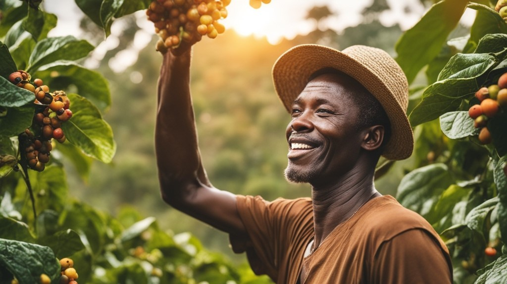

# **COFFEE LEAF DISEASE IMAGE CLASSIFICATION**

Collaborators:

- Crystal Wanjiru
- Randell Mwania
- Victorine Imbuhila
- Sadi Kiri
- Ian Kedeyie
- Simon Ng'ethe

## 

## **Business Understanding**

Imagine the rolling hills of Kenya, vibrant with emerald coffee plantations. But a silent threat looms – Coffee rust, Cercospora, and Phoma, diseases capable of wiping out entire harvests and jeopardizing the livelihoods of thousands of small-scale farmers. This project rises to the challenge, wielding a powerful weapon: cutting-edge technology for early and accurate disease detection.

By empowering farmers with this knowledge, we equip them to act swiftly. Timely application of targeted fungicides becomes their shield, minimizing crop losses and protecting their precious income. It's more than just protecting profits; it's safeguarding a cultural cornerstone, preserving the deep-rooted tradition of Kenyan coffee and ensuring the sustainability of the prized Arabica bean.

This project is not just about numbers and yields; it's about people, communities, and the future of a cherished heritage. Join us in this fight to secure the verdant tapestry of Kenyan coffee farms, one healthy leaf at a time.

## **Data Understanding**

The dataset contains leaf images which were collected from Arabica coffee type and it shows three sets of Phoma, Rust and Cescospora images and one set of healthy images. The data was obtained from [Dataset on Mendeley](https://data.mendeley.com/datasets/t2r6rszp5c/1), [Dataset on Mendeley](https://data.mendeley.com/datasets/tgv3zb82nd/1) and web scrapping with the 'Download All images' extension from the chrome web store.

## **Data Preparation**

The data pre-processing involved noise filtering and contrast stretching.

To ensure uniformity, non-square images were cropped to obtain central square portions.

To mitigate overfitting and enhance smaller datasets, data augmentation techniques such as rotation and flipping were applied, expanding the collected field images into larger datasets.

## **Exploratory Data Analysis**

Visualising the data revealed the presence of four classes with balanced distribution in the train and test sets.

Image statistics like mean and standard deviation(std) for each color channel were calculated and analysed.

## **Modeling**

Four CNN models were developed and evaluated:

- Baseline Model: A simple CNN with flatten and dense layers.
- Model 2: Deeper CNN with additional convolution layers and max pooling.
- Model 3: CNN with increased complexity in convoution layers and dense layers.
- Model 4: Most complex CNN with additional convolution layer and increased units in dense layers.

## **Results**
